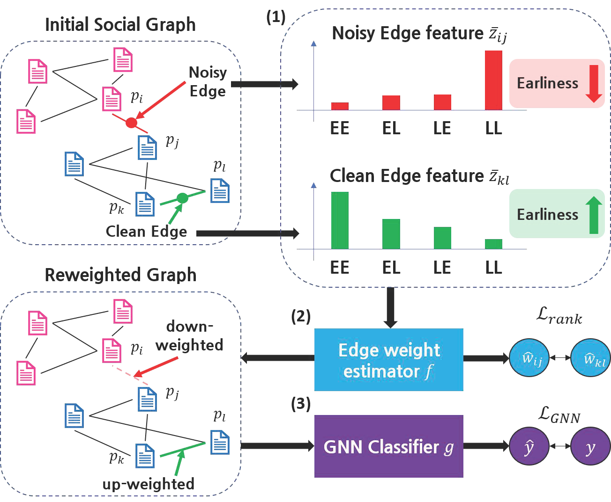

# [WSDM'25] Revisiting Fake News Detection: Towards Temporality-aware Evaluation by Leveraging Engagement Earliness

<p align="center">   
    <a href="https://pytorch.org/" alt="PyTorch">
      </a>
    <a href="https://www.wsdm-conference.org/2025/" alt="Conference">
        </a>
</p>

The source code of the novel method for **D**etecting fake news via e**A**rliness-guided re**W**eighti**N**g ( **DAWN** ) from the paper "[Revisiting Fake News Detection: Towards Temporality-aware Evaluation by Leveraging Engagement Earliness]()" at WSDM 2025.

Junghoon Kim*, Junmo Lee*, Yeonjun In, Kanghoon Yoon, and Chanyoung Park

\* Both authors contributed equally to this research.

## Abstract
Social graph-based fake news detection aims to identify news articles containing false information by utilizing social contexts, e.g., user information, tweets and comments. However, conventional methods are evaluated under less realistic scenarios, where the model has access to future knowledge on article-related and context-related data during training. In this work, we newly formalize a more realistic evaluation scheme that mimics real-world scenarios, where the data is ***temporality-aware*** and the detection model can only be trained on data collected up to a certain point in time. We show that the discriminative capabilities of conventional methods decrease sharply under this new setting, and further propose **DAWN**, a method more applicable to such scenarios. Our empirical findings indicate that later engagements (e.g., consuming or reposting news) contribute more to noisy edges that link real news-fake news pairs in the social graph. Motivated by this, we utilize feature representations of engagement earliness to guide an edge weight estimator to suppress the weights of such noisy edges, thereby enhancing the detection performance of **DAWN**. Through extensive experiments, we demonstrate that **DAWN** outperforms existing fake news detection methods under real-world environments.

## Overall Architecture
<p align="center"></p>

## Requirements
- python=3.9.18
- pytorch=1.12.1
- scikit-learn=1.3.0
- numpy=1.26.3
- scipy=1.11.4 
- pyg=2.4.0 (torch-geometric)
- twitter=1.19.6

## Data Download/Customization

You can download our paper's implementation version or directly customize the dataset with different hyperparameters. Here's the following procedures.

### 1. Use paper's implementation version

- You can download paper's pre-determined version of two datasets in this drive [link](https://drive.google.com/drive/folders/1YbHgef66Jkf_0EaT7GTWm8VmEb3eSEi7?usp=sharing).
- Download each folder and place it in the current directory. (We upload our datasets into drive link due to large file size.)

### 2. Customize the dataset with different hyperparameters

- You can generate a customized dataset with different hyperparameter settings (e.g. deadline, threshold) with ```construct_data.py``` files. 

- First, `obj_base_data.pkl` files should be located in the `main/obj/` directory.
  * For exmple, relative path for gossipcop `pkl` file should follow the form as `main/gossipcop/gossipcop_base_data.pkl`

- Second, select your desired hyperparameters as follows.

  * #### Short Explanations for dataset hyperparameters

    * `--obj:` name of dataset (e.g. `'politifact'`, `'gossipcop'`)

    * `--train_ratio:` training ratio for experiments (e.g. `0.7`)

    * `--valid_ratio:` valid ratio for experiments (e.g. `0.2`)

    * `--u_thres:` threshold for active user (e.g. `3`)

```bash
python construct_data.py --obj 'gossipcop' --train_ratio 0.7 --valid_ratio 0.2 --u_thres 3
```

- Third, check the directory to see if the full data `pkl` file is well made.
  * Example of relative path for gossipcop full data file : `main/gossipcop/gossipcop_t3_train_ratio0.7_valid_ratio0.1_full.pkl`

## How to Run?
You can run the model our paper's best performance hyperparameter set or your desired hyperparameter set.

### 1. Use paper's implementation version

- You can use shell file for running ```run.py``` with our best performance hyperparameter set.
```bash
sh run.sh
```

### 2. Use customized version

- You can use your customized dataset and select your desired hyperparameters as follows.

  * #### Short Explanations for model hyperparameters

    * `--dead_criterion:` deadline for engagements ($t_d$ in our paper) / should follow the form as `'12hrs'` or `'30m'`

    * `--early_thres:` threshold for users ($thres_u$ in our paper)

    * `--hidden_dim:` size of gnn hidden layer dimension

    * `--epochs:`  number of epochs for training DAWN

    * `--lr:` learning rate for training the model  

    * `--margin:` margin for ranking loss 

    * `--sampling_num:` number of sampling ( $K$ in our paper ) 

    * `--alpha:` balancing the contribution of the ranking loss ( $alpha$ in our paper ) 

```bash
python run.py --dataset_name 'gossipcop' --gpu 5 --epochs 1000 --iters 5 --dead_criterion "12hrs" --early_thres 0.7 --sampling_num 10000 --margin 0.0 --alpha 0.3
```


